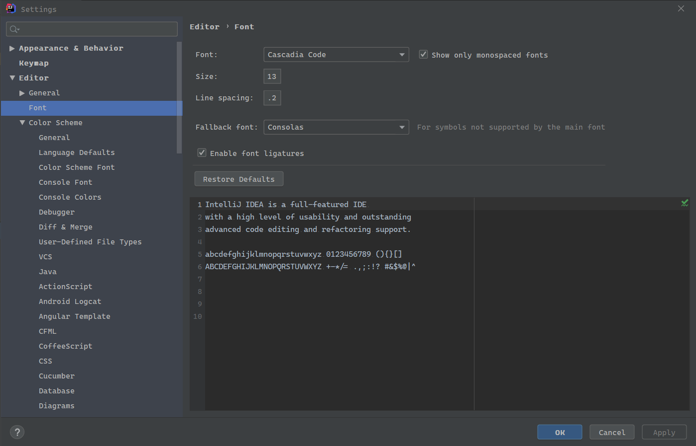

# Welcome!

This repository contains the source code of Cascadia Code.

Other related repositories include:

- [Windows Terminal](https://github.com/microsoft/terminal)

# Installation

**You can install the latest version of Cascadia Code from the releases page here:** https://github.com/microsoft/cascadia-code/releases

Clicking on the Cascadia.ttf file will download it to your machine. From there, open the file. This will open a new window displaying the characters included in the font along with the font displayed at different sizes. This window should have an "Install" button that will install the font on your machine when clicked.

👉 **Note:** If you have previously installed a version of Cascadia Code, installing a new version *should* overwrite the previous version. However, in order to ensure it is completely overwritten, it is recommended that you delete the previous version you had before installing another.

# Contributing

This project welcomes contributions and suggestions. Most contributions require you to
agree to a Contributor License Agreement (CLA) declaring that you have the right to,
and actually do, grant us the rights to use your contribution. For details, visit
https://cla.microsoft.com.

When you submit a pull request, a CLA-bot will automatically determine whether you need
to provide a CLA and decorate the PR appropriately (e.g., label, comment). Simply follow the
instructions provided by the bot. You will only need to do this once across all repositories using our CLA.

# Getting Started

## Modifying the Font

Making modifications to the Cascadia Code font requires use, and understanding, of [Glyphs](https://glyphsapp.com/) (Mac) as well as [Microsoft VTT](https://docs.microsoft.com/en-us/typography/tools/vtt/) (Windows) and to a lesser extent [FontTools](https://github.com/fonttools/fonttools). The source for the font is built in Glyphs, and can be modified to a user’s preference. However, please note that hinting built into the font is closely tied to the glyph order and point order—modifications to either will result in needing to manually correct any problems. 

### Modifying a single glyph

1) Make the necessary changes in the Glyphs source and export a TTF file. 
2) Open the previous VTT TTF source file in VTT and locate the code point that you changed in the source. 
3) Import the glyph and overwrite the code point in the source file. If it is to be added to the end of the file, on the import screen choose “append to end of font”.
4) Hint (or re-hint) the glyph. 
5) Ship the production font. 

### Modifying a broad range of glyphs

1) Make the necessary modifications to the Glyphs source and export a TTF file. 
2) Convert both the new TTF and the VTT TTF source file to TTX using FontTools.
3) Copy the TSI tables from the VTT TTF source to the new TTF source, and rebuild the TTF file. 
4) Open new TTF file in VTT, compile and check for errors. Correct as necessary. 
5) Ship the production font. 

In cases of extensive glyph modification, the font may need to be re-hinted entirely.

## Creating a Pull Request

At the moment, we do not have a testing framework for verifying proper character creation. When creating a pull request, please heavily document the steps you took along with images displaying your changes. Additionally, please provide images of the updated character(s) at different screen sizes to validate proper hinting.

## Communicating with the Team

The easiest way to communicate with the team is via GitHub issues. Please file new issues, feature requests and suggestions, but **DO search for similar open/closed pre-existing issues before you do**.

Please help us keep this repository clean, inclusive, and fun! We will not tolerate any abusive, rude, disrespectful or inappropriate behavior. Read our [Code of Conduct](https://opensource.microsoft.com/codeofconduct/) for more details.

If you would like to ask a question that you feel doesn't warrant an issue (yet), please reach out to us via Twitter:

Aaron Bell, Font Designer: [@aaronbell](https://twitter.com/aaronbell)

Kayla Cinnamon, Program Manager: [@cinnamon_msft](https://twitter.com/cinnamon_msft)

Rich Turner, Program Manager: [@richturn_ms](https://twitter.com/richturn_ms)

# Roadmap

This is the planned roadmap for Cascadia Code. Please be aware that the delivery dates are estimates and the features may arrive slightly earlier or later than predicted. This roadmap will continuously be updated as further features come along.

| Delivery Date | Feature | Description |
| ------------- | ------- | ----------- |
| October 2019 | Conversion of GitHub Pipeline/Workflow | Converting the GitHub pipeline to UFO to allow for users who don't have Macs to contribute to the source code. |
| November 2019 | Character Set Extensions | The addition of Greek, Cyrillic, and Vietnamese, and other characters to the main character set. |
| March 2020 | Weight Axis | Converting Cascadia Code into a variable font with milestone light and bold weights. |
| March 2020 | Arabic and Hebrew Characters | The addition of Arabic and Hebrew characters to the main character set. |

# Installing Cascadia Code in VS Code

1. Go to `File > Preferences` or hit `Ctrl + ,` in VS Code.
2. Enter "Font Face" in search field.
3. Enter following in Font Face option: `'Cascadia Code', Consolas, 'Courier New', monospace`.
4. Enable `Font Ligatures` option available just below 'Font Face'.
5. Press `Enter` and you're good to go.

> Note: If you've installed font and it does not get applied in VS Code, try restarting VS Code.

# Setting Cascadia Code in Visual Studio 2019

1. Go to `Tools > Options` in Visual Studio 2019.
2. Enter "Fonts and Colors" in search field or go to `Environment > Fonts and Colors`.
3. Select `Text Editor` in `Show settings for:`.
4. In the `Fonts` Dropdown select `Cascadia Code`.
5. Press `Ok` and you're good to go.

> Note: If you've installed the font and it does not get applied in Visual Studio 2019, try restarting Visual Studio 2019.

  

# Setting Cascadia Code in Windows Terminal (Preview)

1. Go to the Dropdown `Preferences` or hit `Ctrl + ,` in Windows Terminal (Preview).
2. Open the `profiles.json` in an editor like VS Code.
3. Scroll down to the `"profiles"` Property.
4. Look for your desired profile.
5. Change the `"fontFace"` attribute to `"fontFace": "Cascadia Code"`.

 Font Settings")

 Font Settings")

# Setting Cascadia Code in IntelliJ IDE 2019

1. Go to the Dropdown `File > Settings` or hit `Ctrl + Alt + S` in IntelliJ IDE 2019.
2. Enter "Appearance" in search field or go to `Editor > Font`.
4. Select `Cascadia Code` in the Dropdown.
5. Select Enable Font Ligatures
6. Press Ok and you're good to go.

# Code of Conduct

This project has adopted the [Microsoft Open Source Code of Conduct](https://opensource.microsoft.com/codeofconduct/). For more information see the [Code of Conduct FAQ](https://opensource.microsoft.com/codeofconduct/faq/)
or contact [opencode@microsoft.com](mailto:opencode@microsoft.com) with any additional questions or comments.
