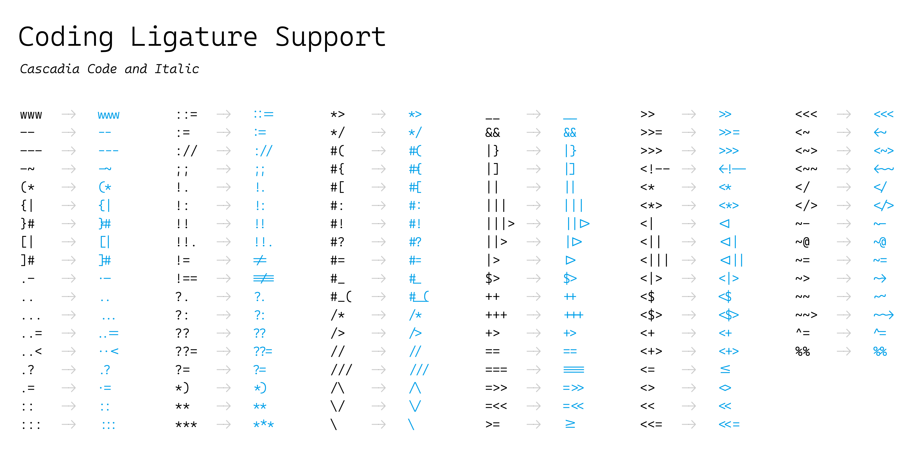
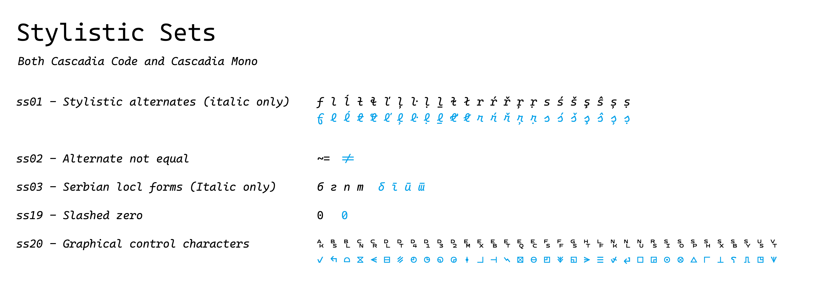
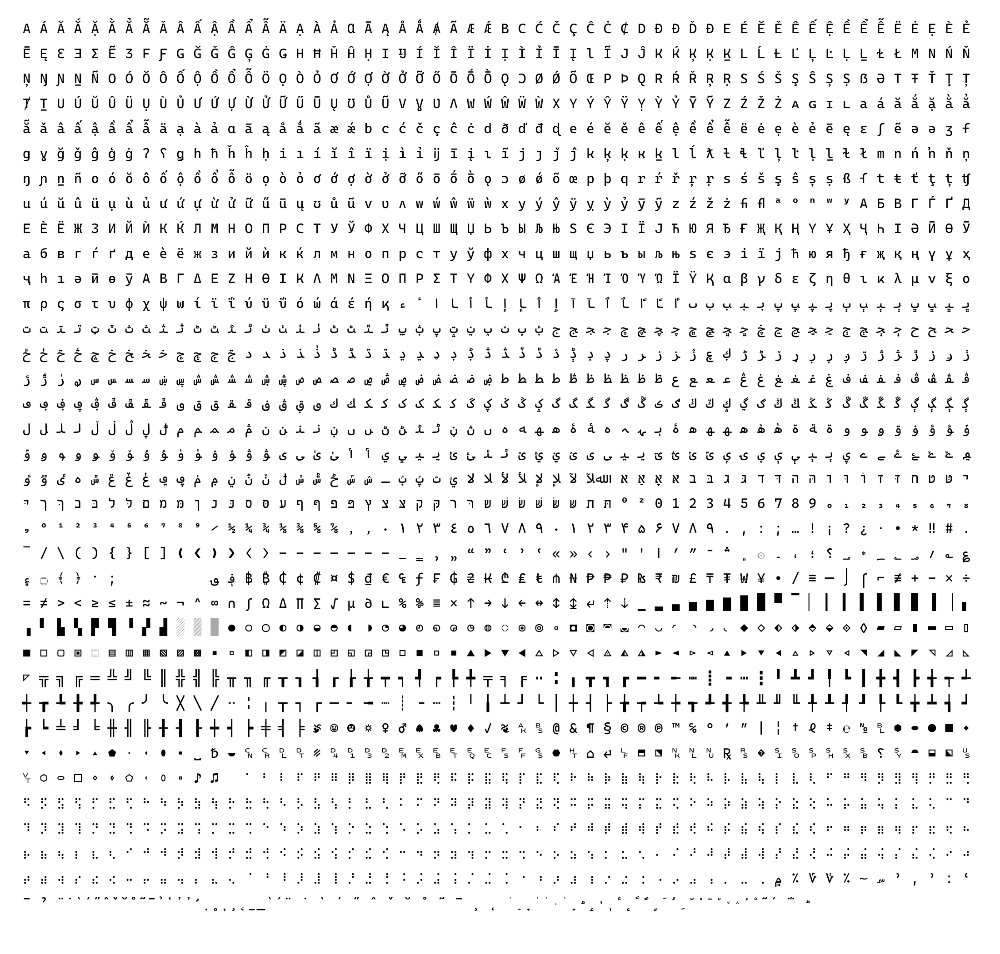
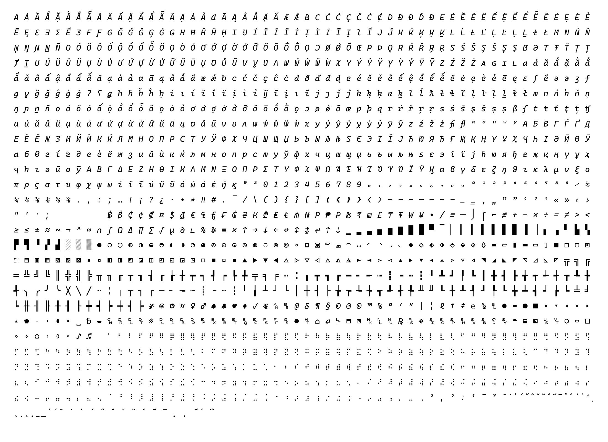
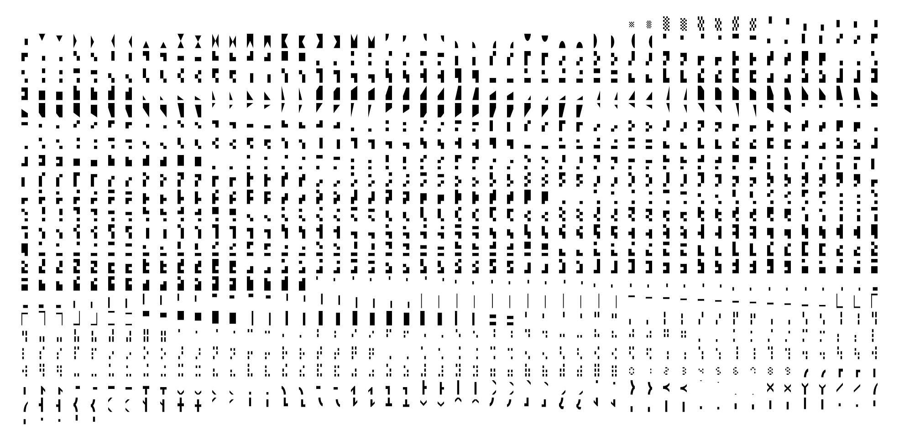

# About Cascadia Code
Cascadia is a fun new coding font that comes bundled with [Windows Terminal](https://github.com/microsoft/terminal), and is now the default font in Visual Studio as well. 

# Font Variants
-  `Cascadia Code`: standard version of Cascadia
-  `Cascadia Mono`: a version of Cascadia that doesn't have ligatures
-  `Cascadia (Code|Mono) PL`: a version of Cascadia that has embedded Powerline symbols
-  `Cascadia (Code|Mono) NF`: a version of Cascadia that has Nerd Font symbols

For the italic, there is a standard `italic` and a `cursive` variant accessible via `ss01` (see [below](https://github.com/microsoft/cascadia-code/blob/main/README.md#to-enable-the-cursive-form-of-the-italic-heres-the-code-you-should-use)). 

# Font features





Enabling stylistic sets will [vary between applications](https://github.com/tonsky/FiraCode/wiki/How-to-enable-stylistic-sets). For example, in VS Code, you can enable stylistic sets (and other OpenType features) via `settings.json`:

```
"editor.fontLigatures": "'ss01', 'ss02', 'ss03', 'ss19', 'ss20'"
```

#### To enable the Cursive form of the italic, here's the code you should use:
```
"editor.fontLigatures": "'calt', 'ss01'",
```
If you're using an environment that does not support the `ss01` OT feature, one option to consider is [opentype-feature-freezer](https://github.com/twardoch/fonttools-opentype-feature-freezer/).

# Character Sets




# Installation

**You can download the latest version of Cascadia Code from the releases page here:** [https://github.com/microsoft/cascadia-code/releases](https://github.com/microsoft/cascadia-code/releases)

##### Font formats:

- `ttf variable`: we recommend this version for **all users,** and particularly those on Windows or any other OS that employs TrueType hinting. It offers the greatest diversity of weight options (anything from 200-700).
- `ttf static`: in the rare situation where the above variable font version is not supported, or a singular weight is preferred to the entire range, static formats are supplied. However, please note they do not have the same degree of hinting quality as the variable font versions.
- `otf static`: for users who prefer OTF format fonts, otf static instances are provided. At this time we do not have a variable font OTF version. 
- `WOFF2`: These versions are provided for the purposes of web use, and are available both as variable fonts, and static instances. 

Once unzipped, right-click the font file and click `Install for all users`. This will install the font onto your machine. 

👉 **Note:** If you have previously installed a version of Cascadia Code, please uninstall the previous version *prior* to installing a new version. Not doing so can result in improper rendering. 

For more details and app-specific instructions, [please check the wiki](https://github.com/microsoft/cascadia-code/wiki/Installing-Cascadia-Code). 

# Get involved
Instructions on how to modify and submit an update to the Cascadia Code source is [available in the wiki](https://github.com/microsoft/cascadia-code/wiki/Modifying-Cascadia-Code).


# Communicating with the Team

The easiest way to communicate with the team is via GitHub Issues. Please file new issues, feature requests and suggestions, but **DO search for similar open/closed pre-existing issues before you do**.

Please help us keep this repository clean, inclusive, and fun! We will not tolerate any abusive, rude, disrespectful or inappropriate behavior. Read our [Code of Conduct](https://opensource.microsoft.com/codeofconduct/) for more details.

If you would like to ask a question that you feel doesn't warrant an issue (yet), please reach out to us via Twitter:

Aaron Bell, Font Designer: [@aaronbell](https://twitter.com/aaronbell)

Christopher Nguyen, Product Manager: [@nguyen_dows](https://twitter.com/nguyen_dows)

Dustin Howett, Software Engineer: [@DHowett](https://twitter.com/DHowett)

_Special thanks_ to:
- Fira Code – OpenType code for the coding ligatures – [github](https://github.com/tonsky/FiraCode)
- Nerd Fonts – Centralizing app iconography – [github](https://github.com/ryanoasis/nerd-fonts)
- Viktoriya Grabowska – Designer of Cyrillic Italic and Consultant – [@vika_grabowska](https://twitter.com/vika_grabowska)
- Mohamad Dakak - Arabic designer - [@mohamaddakak](https://twitter.com/mohamaddakak)
- Liron Lavi Turkenich - Hebrew designer - [@LironLaviTur](https://twitter.com/LironLaviTur)
- Gerry Leonidas – Greek Consultant – [@gerryleonidas](https://twitter.com/gerryleonidas)
- Donny Trương – Vietnamese Consultant – [Vietnamese Typography](https://vietnamesetypography.com)

# Code of Conduct

This project has adopted the [Microsoft Open Source Code of Conduct](https://opensource.microsoft.com/codeofconduct/). For more information see the [Code of Conduct FAQ](https://opensource.microsoft.com/codeofconduct/faq/)
or contact [opencode@microsoft.com](mailto:opencode@microsoft.com) with any additional questions or comments.
